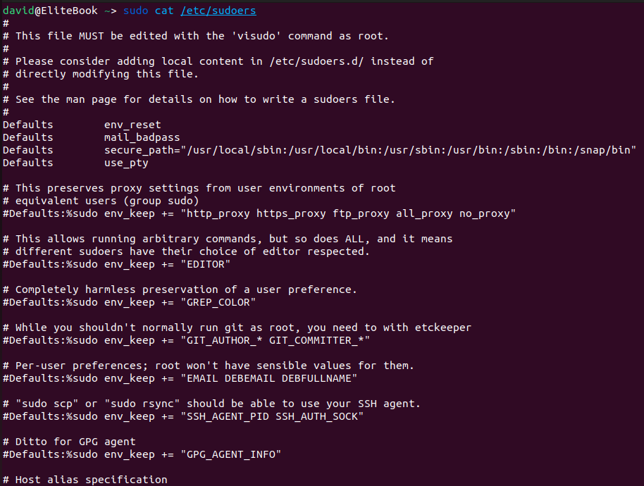

# users and groups

## group

the complete content is in /contents/group.txt

## passwd

the complete content is in /contents/passwd.txt

## sudoers

the complete content is in /contents/sudoers.txt

