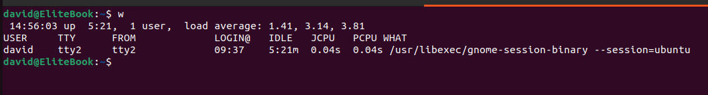

# Linux Commands

## 1. last

Displays the last users who have logged onto the system

## 2. who

Shows who is logged into the system

## 3. w

Shows who is logged in and what they are doing

## 4. dig domain

Displays DNS information for domain

## 5. dir

Displays files in the current directory of a computer

## 6. hostname

Shows system host name

## 7. ip a

Displays all network interfaces and IP address

## 8. last reboot

Shows system reboot history

## 9. ls

Lists all files and directories in the present working directory

## 10. ps

Gives the status of processes running for a user

